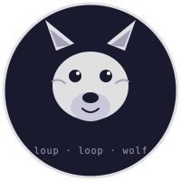

# Loop — Autonomous Dev Pipeline for GitHub Projects



> *Loop — the pack that ships.*

> Label an issue. Walk away. Loop opens a PR, reviews it, runs QA, merges.
> 24/7. Multi-project. Bring-your-own AI agent.

The name is a nod to _loup_, French for wolf — a predator that hunts in packs, never stops, and always ships.

```
   You label an issue                  ┌──────────────────────────────┐
                                       │                              │
        │                              │   24/7 scanner               │
        ▼                              │   one operator, many repos   │
  ┌──────────┐   ┌──────────┐   ┌──────┴────┐   ┌──────────────┐     │
  │   Plan   │──▶│  Review  │──▶│    QA     │──▶│  Auto-Merge  │─────┘
  │ implement│   │  approve │   │ build/test│   │  squash +    │
  │ + open PR│   │  or ask  │   │ validate  │   │  close issue │
  └──────────┘   └──────────┘   └───────────┘   └──────────────┘
        │             │              │
        ▼             ▼              ▼
       blocked   needs-rework    qa-fail → dev-rework
```

**What's different about Loop:**

- **24/7 autonomous** — runs as a background scanner (launchd / cron). No
  slash-commands, no human invocation. You label an issue at midnight, you
  see a PR by morning.
- **Multi-project from one install** — manage a dozen repos with one
  scanner and one config file. Per-project locks, concurrency caps, and
  workflow choices.
- **Bring-your-own workflow** — pipeline stages and the labels that drive
  them are declared in `config/workflows/<name>.yaml`. Ship one of three
  starters or write your own. Per-project label overrides supported.
- **Bring-your-own AI** — `claude`, `codex`, `gemini`, `aider`, or a
  custom CLI via `LOOP_AGENT`. No vendor lock-in.
- **Bounty + judge layer** — companion [loop-monitor](https://github.com/svv2014/loop-monitor)
  dashboard tracks role-level points across the pipeline and runs an AI
  judge that posts a scorecard comment on every merged PR.
- **Backend agnostic** — GitHub default; GitLab and Jira+GitLab adapters
  ship in `lib/backends/`.

## Install

Three commands. No file editing required.

```bash
git clone https://github.com/svv2014/loop.git && cd loop
./install.sh --bootstrap            # auto-detects agent, writes loop.env, registers scanner
./install.sh /path/to/your-project  # registers project + smoke-tests the scanner
```

Bootstrap auto-detects your agent (`claude`, `codex`, `gemini`, or `aider`) and writes
`LOOP_AGENT` to `loop.env`. No manual editing needed for the happy path.

Then label an issue to start the pipeline:

```bash
# Rough idea — PO agent expands the spec, then implements:
gh issue edit <number> --repo owner/repo --add-label po-review

# Already have a full spec — skip PO and go straight to implementation:
gh issue edit <number> --repo owner/repo --add-label dev
```

The scanner picks it up within 5 minutes and opens a PR automatically.

```bash
# Check that everything is healthy at any time:
./install.sh status
```

<details>
<summary>Advanced config — agent override, GitLab, other agents, loop-monitor</summary>

To override the detected agent, edit `loop.env`:

```bash
LOOP_AGENT=codex           # or: gemini, aider, custom
LOOP_AGENT_MODEL=o4-mini   # optional model override
```

Or re-bootstrap with an explicit agent:

```bash
LOOP_AGENT=gemini ./install.sh --bootstrap
```

For GitLab, Jira+GitLab, loop-monitor integration, and full configuration reference —
see [docs/quick-start.md](docs/quick-start.md).

</details>

## How a feature flows through Loop

1. **You** open an issue, write what you want, label it `po-review` (rough idea — PO agent expands the spec first) or `dev` (pre-written spec — skip straight to implementation).
2. **Scanner** notices the label within 5 minutes, fires the dev handler.
3. **Dev handler** invokes your AI agent in an isolated git worktree.
   Agent reads the issue, writes code, opens a PR, labels it
   `needs-review`.
4. **Review handler** sends the diff back to an AI agent for an
   approve/reject decision. On approve → `needs-qa`. On reject →
   `needs-rework` and back to step 3.
5. **QA handler** runs four-phase smart QA: verifies acceptance criteria,
   creates targeted tests, runs regression on touched modules, then runs
   the project's `validation_cmd`. Posts a structured `### QA verification`
   comment. On pass → `qa-pass`. On fail → `qa-fail` → dev-rework.
6. **Merge handler** squash-merges, closes the linked issue, records a
   bounty event, triggers the judge for a PR scorecard.
7. **Reconciler** runs every 15 minutes to clean up stuck states,
   duplicate PRs, dependency unblocks, and red-CI PRs (see below).

The whole flow is just labels on issues and PRs. You can intervene at
any stage by manually labeling.

## Workflows (bring your own)

Loop ships three starter workflows in `config/workflows/`:

| Workflow | When to use |
|---|---|
| `default.yaml` | New repos. Clean canonical labels: `po-review` / `dev` / `needs-review` / `needs-qa` / `qa-pass`. Five-stage pipeline with PO expansion + rework loop. |
| `minimal.yaml` | Solo prototypes. Two stages: `plan → merge`. No review, no QA. |
| `docs-only.yaml` | Documentation and content PRs. Three stages: `plan → review → merge`. No QA gate. |

`current.yaml` is an operator-local workflow (gitignored). If you're migrating from a repo that already uses legacy labels (`dev` / `review-pending` / `ready-for-qa`), create it locally — see [`docs/migration-from-asdlc.md`](docs/migration-from-asdlc.md) for a full label mapping and setup instructions.

Per-project workflow + label overrides in `config/projects.yaml`:

```yaml
version: 1
projects:
  - name: My App
    slug: myapp
    repo: owner/my-app
    workflow: default              # references config/workflows/default.yaml
    labels:                        # optional — sparse overrides
      plan: dev                    # repo uses 'dev' instead of 'plan'
      qa-pass: approved
```

Author your own — see [`config/workflows/README.md`](config/workflows/README.md).

## Configuration

- `loop.env` — operator-specific env (log dir, agent choice, dispatch mode,
  notifications, PATH extras). Copy from `loop.env.example`. **Not committed.**
- `config/projects.yaml` — your project registry. **Not committed.**
- `config/projects.example.yaml` — annotated schema reference.
- `config/workflows/*.yaml` — pipeline workflow definitions. Committed.

## Auto-rework on red CI

When Loop opens a PR (branch convention `feat/issue-N-*`) and a **required**
CI check fails, the reconciler automatically applies `needs-rework` to the PR
and strips the parent issue's trigger label so the dev agent can fix the
failures on the next cycle. The reconciler is a no-op when:

- The PR already carries `needs-rework` or `changes-requested`.
- A human reviewer has approved or requested changes.
- The failing check is not marked as **required** in the repository settings.

A `pr_ci_failed` event is posted to loop-monitor (if `LOOP_MONITOR_URL` is
set in `loop.env`) for observability.

**To opt out per project**, add `dev.auto_rework_on_ci: false` to the project
entry in `config/projects.yaml`:

```yaml
projects:
  - slug: myapp
    repo: owner/my-app
    dev:
      auto_rework_on_ci: false   # disable reconciler auto-rework on red CI
```

## Supported AI agents

Set `LOOP_AGENT` in `loop.env`:

| `LOOP_AGENT` | CLI | Notes |
|---|---|---|
| `claude` (default) | [Claude Code](https://docs.anthropic.com/en/docs/claude-code) | First-class support; default model `sonnet`. |
| `codex` | OpenAI Codex CLI | |
| `gemini` | Google Gemini CLI | |
| `aider` | [Aider](https://aider.chat) | |
| `custom` | `LOOP_AGENT_CMD=<path>` | Roll your own — Loop pipes the prompt to stdin. |

## Architecture

Single scanner process polls GitHub every 5 minutes across all configured
projects. For each project, it asks the active workflow which labels to
poll, then dispatches events to handlers. Handlers acquire a per-project
lock, invoke the AI agent in a worktree, swap labels, exit. The
reconciler runs every 15 minutes to fix drift.

See [`docs/architecture.md`](docs/architecture.md) for the full diagram
and component breakdown.

## Security model

Loop is a single-machine automation tool — it runs the AI agent's code
on your machine, with your shell, and your `gh` credentials. Treat it
accordingly:

- **Pipeline labels are collaborator-only.** Anyone with write access to
  the repo can apply `plan`, `needs-qa`, etc. and trigger the pipeline.
  External users cannot.
- **Fork PRs are gated.** `qa-handler` refuses to run a project's
  `validation_cmd` against external-fork PR code unless a maintainer
  applies the `safe-to-test` label first.
- **Branch protection is required for production repos.** Configure
  `require code-owner approval` on `main` so even the operator's own
  PRs need a CODEOWNERS-listed reviewer.

See [`docs/security-model.md`](docs/security-model.md).

## Status check

Get a one-shot runtime health summary of the running pipeline:

```bash
./scripts/status.sh
```

Example output:

```
loop status — 2026-05-09 14:22:11

scanner              OK       (PID 60401, last tick 4m12s ago, interval 30m)
orchestrator         --       (LOOP_ORCHESTRATOR not set)
event-queue          --       (LOOP_EVENT_QUEUE_URL not set)
retry-counters       OK
  loop-monitor#119 (2/2 — needs-clarification)
active-handlers      OK
  PO PID 9821 (started 1m38s ago)
recent-failures      OK       (none in last 24h)
```

Machine-readable output:

```bash
./scripts/status.sh --json
# {"status":"ok","checks":{...},"retry_counters":[...],"active_handlers":[...],"recent_failures":[...]}
```

Exit codes: `0` = all OK, `2` = any DEGRADED, `1` = any FAIL.

> **Note:** `./install.sh status` is the install-time variant that checks env
> files, agent CLI availability, and `gh` auth. `scripts/status.sh` is the
> runtime variant that checks live pipeline state.

## Development

```bash
# Lint
bash -n lib/*.sh scripts/*.sh scanner/*.sh install.sh
shellcheck -S warning lib/*.sh scripts/*.sh scanner/*.sh install.sh

# Tests
bats tests/

# Validate workflow YAML files
./scripts/validate-workflow.sh
```

## Versioning

Loop adheres to [Semantic Versioning](https://semver.org). Pre-1.0,
MINOR releases may include breaking schema/env changes; each such
release documents the breakage in [CHANGELOG.md](CHANGELOG.md) with a
migration recipe. Post-1.0, strict semver: only MAJOR breaks documented
contracts.

The bounty event API between Loop and loop-monitor is independently
versioned (currently `1.0`).

## Status

`v0.2.0` — production-tested across multiple repos. Introduces four-phase
smart QA (AC verification, targeted test creation, module regression,
`validation_cmd`), 3-command onboarding with agent auto-detect, and
automated release PRs with tag + publish on merge. The pipeline,
workflow-as-config, and the versioned bounty API are first-class
commitments going forward.

[Roadmap](ROADMAP.md) tracks what's next: spec-blind validator stage,
domain specialist agents (frontend / backend / data / devops), expanded
backend coverage.

## Contributing

External contributions welcome. PRs require an approval from a
[CODEOWNERS](.github/CODEOWNERS)-listed reviewer before merging. See
[CONTRIBUTING.md](CONTRIBUTING.md).

## License

[MIT](LICENSE).
